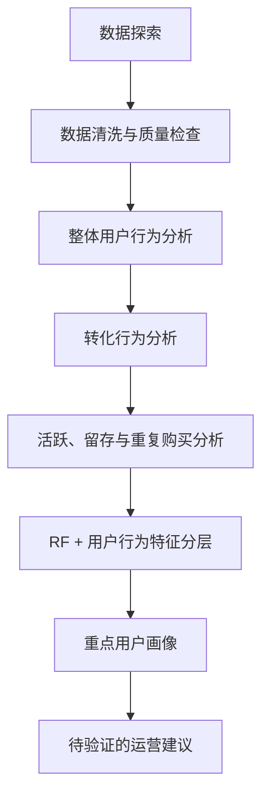
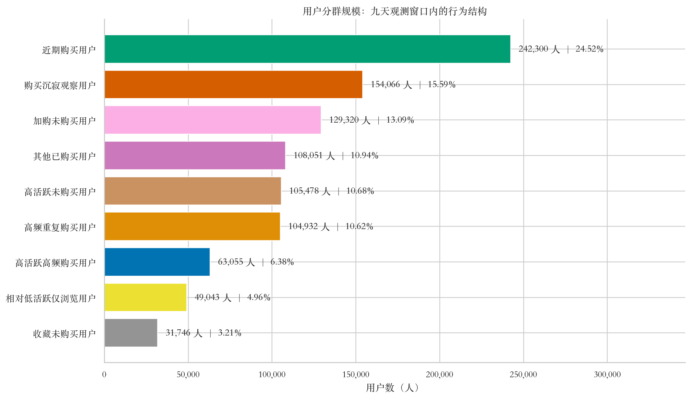
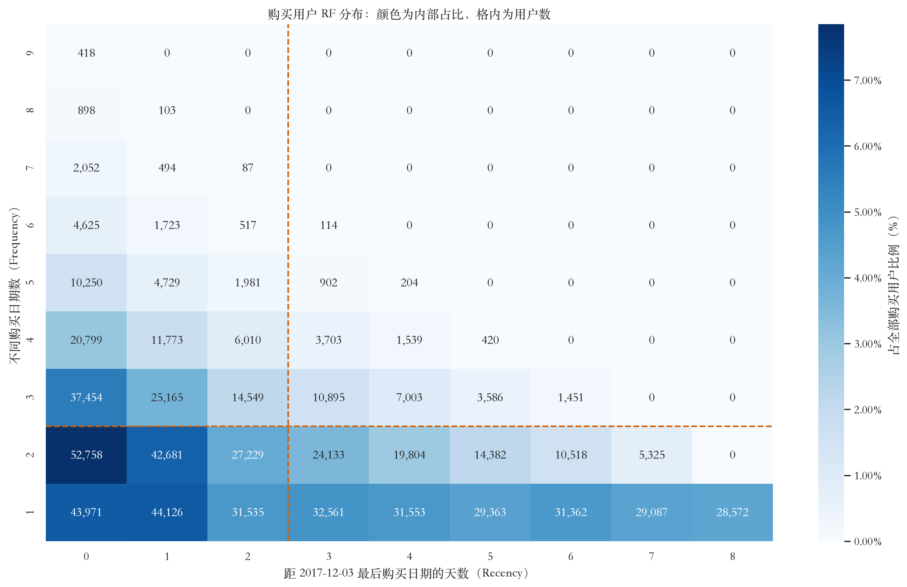
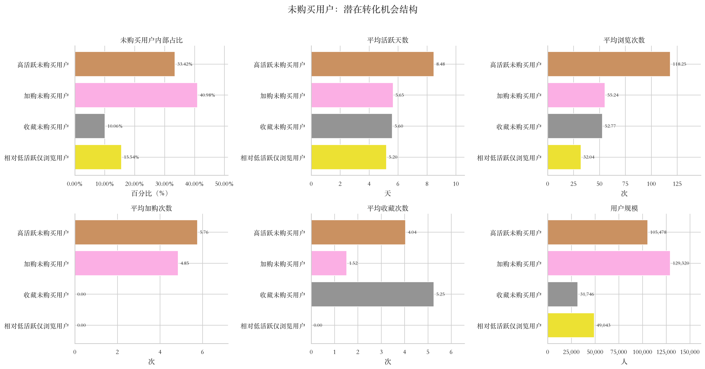
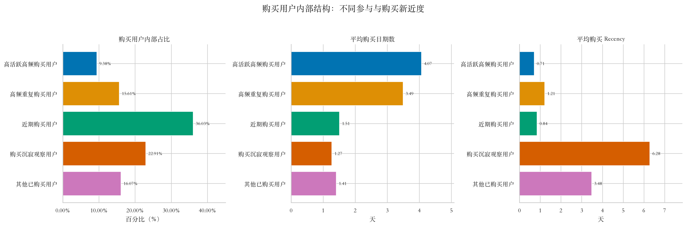
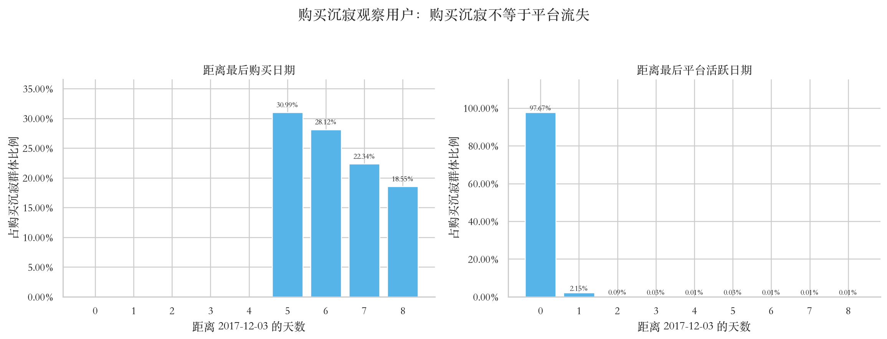

# 电商用户行为分析
E-commerce User Behavior Analysis

基于公开电商平台行为数据，使用 SQL 与 Python 分析九天内的用户活跃、转化、留存和重复购买，并构建 **RF + 用户行为特征分层**，识别值得进一步研究的运营人群。

| 清洗后有效行为记录 | 观测用户 | 购买用户 |
|---:|---:|---:|
| **100,095,182 条** | **987,991 人** | **672,404 人** |

观察期：**2017-11-25 至 2017-12-03，Asia/Shanghai**。buy 是购买行为事件，不是订单。

## 三个关键业务发现

- **高活跃未购买：**105,478 人，其中 **90.01%** 有收藏或加购行为；值得进一步调查兴趣到购买之间的障碍，不能保证未来会购买。
- **购买沉寂不等于流失：**购买沉寂群体中 **97.67%** 在最后一天仍然活跃，不能仅凭购买新近度将其定义为流失用户。
- **窗口内跨日重复购买：**占购买用户 **55.07%**；只表示九天内至少两个日期发生购买，不是长期复购率。

## 技术栈

- **SQL / DuckDB**：大表聚合、条件计数、窗口函数、分位点分层与一致性检查。
- **Python / Pandas / NumPy**：用户特征读取、结果核对和群体画像。
- **Matplotlib / Seaborn**：中文图表、聚合热力图与分指标比较。
- **Jupyter Notebook**：保存可直接阅读的代码、图表与中文解释。
- **Git**：项目版本管理；目录与相对链接适合 GitHub 展示。

## 分析流程



详细阅读：[指标口径](#3-核心指标与口径) · [用户分层](#7-用户分层与重点画像) · [项目限制](#10-项目限制) · [复现方式](#12-如何运行) · [面试总结](reports/project_summary.md)

## 1. 业务背景与问题

这是基于公开电商行为数据的分析作品集项目，不是真实企业内部项目。通过浏览、收藏、加购、购买记录，识别当前观测窗口内的用户行为差异和值得进一步研究的运营机会。


- 平台用户整体活跃情况如何？
- 浏览、收藏、加购与购买呈现什么行为结构？
- 用户是否存在跨日重复购买行为？
- 哪些用户表现出较强商品兴趣但没有观测到购买？
- 哪些购买用户表现出较高参与度，值得重点维护？
- 近期未购买是否意味着用户已经流失？

## 2. 数据说明

数据来源：[阿里云天池 UserBehavior 淘宝用户购物行为数据集](https://tianchi.aliyun.com/dataset/649)。下载和使用须遵循来源页面的访问要求与使用条款；仓库不提供原始数据和数据库。

| 项目 | 当前分析口径 |
|---|---|
| 分析范围 | 2017-11-25 00:00:00 至 2017-12-03 23:59:59，Asia/Shanghai |
| 窗口长度 | 9 个自然日 |
| 清洗后事件数 | 100,095,182 |
| 去重用户数 | 987,991 |
| 核心表 | DuckDB `user_behavior_clean` |
| 清洗处理 | 时间与行为类型过滤；同用户、商品、品类、行为、时间戳的完全重复记录仅保留一条 |

| 字段 | 含义 |
|---|---|
| `user_id` | 用户标识 |
| `item_id` | 商品标识 |
| `category_id` | 品类标识 |
| `behavior_type` | `pv` 浏览、`fav` 收藏、`cart` 加购、`buy` 购买 |
| `timestamp` | Unix 秒级时间戳 |
| `event_time` | 清洗时转换得到的上海本地时间 |

**buy event ≠ 真实订单；first observed date ≠ 注册日期。** 本项目没有价格、交易金额或订单 ID。记录规模为当前数据库实测值，不代表平台全量用户。完全重复记录的处理是日志去重假设，不意味着所有重复行为都是异常。

## 3. 核心指标与口径

| 指标 | 结果 | 定义 |
|---|---:|---|
| 观测活跃用户 | 987,991 | 九天内至少出现一种行为的去重用户 |
| 购买用户 | 672,404 | 九天内至少出现一次 buy 的去重用户 |
| 平均 / 中位活跃天数 | 7.05 / 7 天 | 每个用户出现行为的不同日期数 |
| 跨日重复购买用户 | 370,274 | 至少两个不同日期出现 buy |
| Observed Repeat Purchase User Rate | 55.07% | 跨日重复购买用户 / 购买用户 |
| 高活跃未购买用户 | 105,478 | 按已验证规则划分，窗口内无 buy |
| 购买沉寂观察用户 | 154,066 | 最后购买距 12/03 超过购买人群 Recency Q75 |

## 4. 平台用户行为分析

[平台分析 SQL](sql/03_platform_overview.sql) 从整体规模、每日活跃、行为类型、小时分布及不同日期的变化描述平台样本。活跃定义为发生任意记录行为，平均活跃天数为 **7.05 天**，中位数为 **7 天**。

事件规模与去重用户指标分别计算；购买事件与浏览事件的比值只描述事件结构，不作为用户转化率。

## 5. 转化漏斗分析

[漏斗 SQL](sql/04_conversion_funnel.sql) 区分两种口径：

- **无序集合漏斗：**浏览用户 → 浏览且收藏/加购用户 → 三类行为均发生用户，逐层取交集，不证明时间顺序或同商品路径。
- **严格 user-item 路径：**同一用户、同一商品，浏览后购买，以及浏览后首次收藏/加购、再购买；时间必须严格递增，收藏和加购取并集。

同时保留每日指标、时段整体比例与等长周末对比。每日比例均值不同于时段内重新去重后的比例；不同长度窗口的整体比例受到观察机会影响，不用于直接比较转化表现。两步路径包含三步路径，不能相加，也不能据此推断因果关系。

## 6. 活跃留存与重复购买

[留存与重复购买 SQL](sql/05_retention_repeat_behavior.sql) 分析活跃日期分布、首次观测活跃 cohort 的 D1 与 D0–D7 留存、不同购买日期数及相邻购买日期间隔。

672,404 名购买用户中，**370,274 人**在至少两个不同日期有 buy，占 **55.07%**。同日多条 buy 不构成跨日重复购买，也不会产生零天购买日期间隔。这不是订单复购率或真实长期复购率。

首次观测活跃日不是注册日；留存表示指定后续日期有行为，不要求连续活跃。没有完整后续观察窗口的留存单元格为 **NULL**，不能将右截尾当作流失，12/03 cohort 不参与 D1 比较。

## 7. 用户分层与重点画像

规则采用实际分位点，按优先级首次命中，九类互斥；未购买与仅浏览均限定当前窗口。

| 用户群体 | 用户特征 | 用户规模 | 业务关注点 |
|---|---|---:|---|
| 高活跃高频购买 | 近期、高频且多日活跃 | 63,055 | 维护与推荐 |
| 高频重复购买 | 多个日期购买，未命中优先层 | 104,932 | 关联推荐与购买节奏 |
| 近期购买 | 最近购买，未命中高频层 | 242,300 | 后续购买引导 |
| 购买沉寂观察 | 距最后购买较久，可能仍活跃 | 154,066 | 区分购买沉寂与平台不活跃 |
| 其他已购买 | 中等购买新近度、较低购买日频次 | 108,051 | 品类与购买节奏研究 |
| 高活跃未购买 | 多日参与但未观测到 buy | 105,478 | 转化障碍 |
| 加购未购买 | 有加购，未命中高活跃层 | 129,320 | 购物车机会 |
| 收藏未购买 | 有收藏、无加购，未命中高活跃层 | 31,746 | 兴趣触达 |
| 相对低活跃仅浏览 | 低于相对活跃阈值，无意向与购买 | 49,043 | 低成本探索 |

详细规则见 [分层 SQL](sql/06_user_segmentation.sql)，画像与校验见 [可视化 Notebook](notebooks/05_user_segmentation_visualization.ipynb)。

### 高活跃未购买用户值得调查转化障碍

105,478 人平均活跃 **8.48 天**、浏览 **118.25 次**、加购 **5.76 次**、收藏 **4.04 次**；**90.01%** 有加购或收藏。持续参与与商品兴趣没有对应窗口内购买，可进一步分析商品选择与转化障碍，不能断言未来一定购买。

### 加购未购买群体有明确意向信号

最终分层中该群有 **129,320 人**，占未购买用户 **40.98%**，平均加购 **4.85 次**。可进一步研究商品、价格和优惠因素，但当前没有价格或优惠数据，无法确认具体原因。该群已排除先命中高活跃未购买规则的用户。

### 购买沉寂不等于平台流失

购买沉寂观察用户 **154,066 人**，平均购买 Recency **6.28 天**，但 **97.67%** 在 **2017-12-03** 仍活跃，平均浏览 **96.84 次**、加购 **5.81 次**。将其直接定义为流失会忽略仍在平台互动的事实；值得研究的是再购买机会，而非单凭购买日期启动流失判断。

### 高参与购买用户值得维护

高活跃高频购买用户 **63,055 人**，平均购买活跃日 **4.07 天**、购买品类 **5.68 个**、buy 事件 **6.74 次**、浏览 **164.44 次**。他们在窗口内参与与购买频次较高，但没有金额，不能称为收入贡献最高的用户。

### 单一购买指标不足以描述用户状态

同时观察购买新近度、购买日期频次、平台活跃和意向行为，可以区分仍活跃的购买沉寂者、高活跃未购买者及高参与购买者。“其他已购买”也有清晰结构：**108,051 人**全部为 Recency **3–4 天**、购买日期 **1–2 天**。这些差异部分来自分层规则本身，不是模型预测能力的证据。

## 8. 核心可视化



九类人数互斥，百分比分母为全体观测用户，按规模降序排列。



以用户数聚合展示购买新近度与不同购买日期数，避免绘制几十万个点。空格部分由九天窗口的时间约束造成；这不是标准 RFM。



高活跃与加购未购买群体值得优先调查。内部占比分母为未购买用户，各指标使用独立数轴。



购买用户并非同质群体；内部占比、购买日期数与 Recency 分别展示，不能将 buy 次数视为订单频次。



同一群体的购买新近度与平台活跃新近度明显不同，这是“未购买不等于流失”的直接观察证据。

## 9. 运营建议

| 人群 | 待验证方向 |
|---|---|
| 高活跃高频购买 | 可以考虑个性化推荐、会员权益和新品触达测试 |
| 高活跃未购买 | 建议先调查浏览到购买障碍，再测试推荐与优惠敏感性 |
| 加购未购买 | 可以考虑购物车召回；补充实时商品信息后测试价格变化与库存提醒 |
| 购买沉寂但仍活跃 | 建议结合近期浏览兴趣测试再购买推荐，区别于真正平台不活跃者 |
| 相对低活跃仅浏览 | 可以考虑低成本触达；高成本投放需要额外收益证据 |

当前分析没有证明这些动作有效。验证时需要统一后续观察窗口，尽可能采用随机分组，并同时评估增量购买用户、成本和触达负面反馈。

## 10. 项目限制

- 只有九天，存在左右截尾；首次观测日期不是注册日期，晚出现用户的观测机会较少。
- buy 事件不是订单；无价格与金额，无法计算 Monetary、标准 RFM 或 CLV。
- 无法据此判断真实长期留存、长期复购率或长期生命周期状态。
- 无序行为集合不代表同商品严格路径，收藏与加购不是所有购买者的必经步骤。
- 分位标签仅表示当前样本中的相对状态，整数并列使高分位层不一定恰占 25%。
- 不能将当前样本推广为平台全量情况，也不能从描述性差异证明策略因果效果。

## 11. 项目结构

```text
.
├── README.md
├── requirements.txt
├── .gitignore
├── data/                          # 本地数据，不上传
│   ├── raw/UserBehavior.csv
│   └── processed/ecommerce.duckdb
├── sql/
│   ├── 01_create_tables.sql        # 原始视图、时间清洗、日志去重
│   ├── 02_data_quality_checks.sql  # 规模、缺失、类型、重复检查
│   ├── 03_platform_overview.sql    # 活跃、事件与时间分布
│   ├── 04_conversion_funnel.sql    # 集合/严格顺序漏斗与等长周末对比
│   ├── 05_retention_repeat_behavior.sql # 留存、购买日期与间隔
│   └── 06_user_segmentation.sql    # RF + 行为特征分层
├── notebooks/
│   └── 05_user_segmentation_visualization.ipynb
└── reports/
    ├── project_summary.md         # 面试复习与项目总结
    └── figures/                   # 八张已导出的中文图表
```

SQL 与 Notebook 编号分别表示各自目录的顺序：Notebook 05 对应 SQL 06 的可视化，不代表缺少 Notebook 01–04。

## 12. 如何运行

### 环境和数据

验证环境为 **Python 3.13**；已验证版本列在 [requirements.txt](requirements.txt)。从项目根目录运行：

```bash
python3 -m venv .venv
source .venv/bin/activate
python -m pip install -r requirements.txt
python -m ipykernel install --user --name python3 --display-name "Python 3"
mkdir -p data/raw data/processed
```

Windows 的虚拟环境激活命令为 `.venv\Scripts\activate`。从来源页面取得并解压无表头 `UserBehavior.csv`，放在 `data/raw/`。原始数据约 3.4 GB，当前数据库约 1.3 GB；清洗去重和聚合还需额外内存与临时磁盘空间，初次构建耗时取决于机器配置。

### SQL 执行顺序

先执行 01 构建数据库，再执行 02–06。**01 会重建清洗表，后续分析不修改源表。** 02 的部分检查依赖原始 CSV，不能仅凭数据库运行所有原始数据检查。以下脚本在终端执行，可逐条打印结果（用户明细预览最多 20 行）：

```bash
python - <<'PY'
from pathlib import Path
import duckdb

files = sorted(Path('sql').glob('*.sql'))
for path in files:
    print(f'\n执行 {path.name}')
    with duckdb.connect('data/processed/ecommerce.duckdb',
                        read_only=path.name != '01_create_tables.sql') as con:
        con.execute("SET memory_limit='3GB'")
        con.execute('SET threads=4')
        for statement in con.extract_statements(path.read_text()):
            result = con.execute(statement)
            if statement.type == duckdb.StatementType.SELECT:
                print(result.fetchdf().to_string(index=False))
PY
```

已有数据库且仅重跑分析时，把 `files` 改为从 02 开始；只跑画像可直接执行下面的 Notebook。

### Notebook 执行

当前仅有一个 Notebook，无需先运行其他 Notebook。它会通过只读连接复现 SQL 06，严格核对当前数据版本人数；若下载的数据版本或清洗结果不同，会停止绘图，应先定位差异，不应直接取消断言。

```bash
python - <<'PY'
import nbformat
from nbclient import NotebookClient

path = 'notebooks/05_user_segmentation_visualization.ipynb'
notebook = nbformat.read(path, as_version=4)
NotebookClient(notebook, timeout=600, kernel_name='python3',
               resources={'metadata': {'path': '.'}}).execute()
nbformat.write(notebook, path)
PY
```

也可在支持 Jupyter 的编辑器中从头执行。中文字体需使用 Noto Sans CJK SC、微软雅黑、苹方或 Notebook 支持的其他字体；缺少字体时会停止。输出图像写入 `reports/figures/`，Notebook 保留执行结果，GitHub 阅读不依赖本地数据库。
