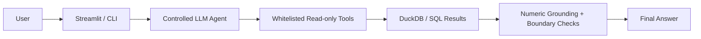

# AI Analytics Agent / 电商运营分析 Copilot MVP

在已验证的 SQL 01–09 与 DuckDB 数据层之上，提供可重复调用、只读、可追溯的运营问答接口，减少问答时重复计算指标与混用口径。没有重做清洗、分层或增长分析。

冻结 baseline 是 **deterministic rule-based prototype**，由接收结构化工具结果的通用 Python reasoning rules 生成解释，不调用模型。独立 AI Analytics Agent 使用 OpenAI Responses API 选择白名单工具并生成解释，已完成首次真实 37-case 运行；两种入口都复用同一只读数据工具。

阅读导航：[LLM 架构](#controlled-llm-agent独立入口) · [Provider 实现](providers/openai_responses.py) · [Evaluator v2 说明](evals/llm_evaluation_v2_README.md) · [Evaluator v2 报告](evals/llm_evaluation_v2_report.md)。

## AI Analytics Agent / Copilot 展示链路



Streamlit 只是 presentation layer，CLI 和 UI 复用同一个 `llm_agent.run`。
controlled tool calling 仅访问白名单 read-only analytics tools，不允许 arbitrary SQL；
API key 仅来自当前环境，不进入源码。这是 portfolio demo，不是 production system。

## 架构

```text
User Question → Intent Routing → Read-only Analytics Tool → DuckDB
              → Structured Result → Deterministic Reasoning → Explanation
```

`agent.py` 只把关键词映射到五个白名单函数，不把问题拼入 SQL。工具返回 dict/list，输出包含 `detected_intent`、`tool_used`、`key_data`、`interpretation`、`caveats`，并显式返回 `status`（answered / unsupported / ambiguous）。解释分为 answer、facts、analysis、candidate_actions、caveats；numeric_evidence 记录展示数值的来源路径、允许的派生公式与格式。关键数值来自本次工具结果或明确派生计算。工具元数据包含数据库相对路径、源表、观察窗口、时区、单位、SQL 来源及 SHA-256，方便核对查询版本。

## 为什么暂不开放自由 SQL

自由生成 SQL 容易改变分母、日期窗口、去重单位，甚至把事件比误当用户转化率。当前复用固定已验证 SQL：SQL 04 只运行集合漏斗部分；SQL 07/08/09 只准备其连接内临时聚合，跳过展示用 SELECT 和清理段。SQL 04 等长周末查询原样保存在工具常量；统计方法沿用 BI 导出脚本。没有用户 SQL 参数或数据库写入接口。

所有工具均使用 `duckdb.connect(..., read_only=True)`，`finally` 关闭连接。固定 SQL 只允许 SELECT、时区设置、CREATE OR REPLACE TEMP TABLE/VIEW；TEMP 对象仅属于当前连接，关闭即释放，数据库持久表不变。临时聚合可能使用 DuckDB spill 空间，读取一亿行仍需时间；此 MVP 不做结果缓存。数据库缺失、查询失败、非法 top_n 均明确报错，CLI 写 stderr 并返回非零状态，不用快照代替结果。

## 五个工具

| 意图 / 工具 | 结构化输出 | 来源 |
|---|---|---|
| platform / get_platform_overview | 总事件、活跃/总用户、商品、品类、四类事件、购买用户 | SQL 03 |
| growth / get_weekend_growth | 两个周末去重用户、事件、人均强度、增长率；首次/此前观测用户及事件贡献；描述性 bridge | SQL 09 |
| funnel / get_funnel_comparison | 日均浏览/意向/购买用户、四项用户集合比例、有效比例天数 | SQL 04 |
| opportunity / get_opportunity_analysis(top_n=5) | 总/合格/机会品类；P1/P2/P3 pair、去重用户与行为均值；Top N、动态门槛 | SQL 08 |
| experiment / get_ab_test_summary | 两组分配人数、购买率、lift、p-value、CI、MDE、simulated_assignment 与 caveat | SQL 07、BI 统计方法 |

`top_n` 必须是 1–100 的整数，使用绑定参数。工具可直接从 `ai_agent.tools` 导入。

## 支持的问题与路由

例如平台规模、周末流量增长、转化漏斗变化、运营优先级/机会品类、模拟实验显著性。关键词规则公开在 `agent.py`；先识别独立任务，多意图返回 ambiguous。单一召回效果问题映射 experiment，用户召回候选映射 opportunity；周末作为时间背景，不单独造成漏斗问题歧义。未知问题与已识别的数据边界问题返回 unsupported，不查询数据库。

路由是轻量关键词匹配，不具备完整语义理解；复杂措辞、否定与多语言变体可能误判。回答覆盖对应意图的通用分析模式，暂不支持任意筛选、用户明细、个性化时间窗口或真实品类名称。

## Deterministic reasoning

`reasoning/diagnostic_rules.py` 将结构化事实转换成业务解释，不接收原始 question，不读取 Golden Set 或 expected_values，不查询数据库。Agent 路由保持原规则，工具继续只返回结构化事实。

可复用规则包括：人数与比例分开判断、相邻环节百分点差比较、优先级不等于购买概率、购买沉寂不等于长期流失、相关不等于因果、模拟分组不等于真实策略效果、规模不等于运营优先级。结论随工具中的指标关系变化，处理方向反转、并列、缺失与无下降。P1/P2/P3 是已声明的业务规则标签，不是对具体问题的专门答案。

unsupported 仍然不调用工具；对购买沉寂仅作一般性的条件说明，不能断言该群体实际仍活跃，也不复制 SQL 06 的群体数值。

## 数据边界

- 2017-11-25–2017-12-03，Asia/Shanghai，九天公开样本，不代表全平台或长期行为。
- buy event ≠ order；newly observed ≠ new registered user；category_id 匿名。
- 无 price / GMV、真实 promotion / channel / exposure，不能确认增长原因、收益或营销因果效果。
- 增长使用两天去重用户，漏斗使用每日人数及每日用户集合比例等权均值；比例以 0–100 表示，百分点以 pp 表示。
- 漏斗非严格同商品路径；品类意向→购买为“意向且购买 / 全部意向”，平台为“浏览且意向且购买 / 浏览且意向”，不能混用。
- 机会池仅机会品类子池，均值按 user-category pair 等权；跨层 distinct_users 不可相加。池使用九天排除目标品类 buy，只能用于 12/03 结束后的下一轮运营。
- A/B Test 为 simulated assignment。没有真实 treatment / exposure，不能证明购物车召回有效或无效，不显著不等于相同。MDE 不是预期效果。

## CLI

从项目根目录，使用已安装项目 DuckDB 依赖的 Python：

```bash
source .venv/bin/activate
python -m ai_agent.agent "为什么第二个周末流量增长了？"
python -m ai_agent.agent "哪类用户最值得优先运营？"
python -m ai_agent.agent "A/B Test 是否证明购物车召回有效？"
python -m ai_agent.agent "哪些品类存在机会？" --top-n 3
python -m ai_agent.evals.run_checks
```

上述 deterministic CLI 仅需 DuckDB，不调用外部 API；LLM CLI 另需模型配置。Agent 核心未添加框架、SDK、RAG 或 MCP；可选 Streamlit UI 仅用于本地展示，不在仓库保存凭据。已有数据库必须存在，不自动执行 pipeline 或重建数据库。CLI 回答成功返回 0，工具执行失败返回 1，unsupported / ambiguous 或参数解析失败返回 2；拒答与歧义仍输出结构化 JSON。

## Evaluation

当前 rule-based prototype 已建立 37 个问题的 Golden Evaluation Set，作为项目 AI 层的回归基准。运行：

```bash
python -m ai_agent.evals.run_evaluation
```

评估意图、实际工具调用、状态、冻结数值、必要事实、数据边界与禁断言，报告真实失败；有失败时进程返回非零。详见 [Evaluation 说明](evals/README.md) 和 [运行报告](evals/evaluation_report.md)。独立 controlled tool calling 使用同一问题集保留 legacy 严格成绩，并以 v2 单独分析多意图集合、工具选择、numeric grounding 与问题专属边界；新增轻量 numeric grounding 独立核验来源路径、difference / pct_change、统计设置与展示格式；仍不全面理解单位语义或每句话的因果含义。

本轮 explanation 改进使 Overall Pass 从 30/37（81.08%）升到 37/37（100%），原 12 个失败路径、16 个评估器自检和 13 个 CLI 回归均通过。新增 15 个反事实 reasoning / grounding tests 验证结论随数据变化、拒绝无来源或伪造数字。expected facts、forbidden claims 和五个工具查询未改变。100% 仅适用于冻结测试集，不代表任意措辞或业务问题都正确。

## 下一阶段

Deterministic baseline 在原 37 个 Golden cases 上全部通过，已冻结。独立受控 LLM Tool Calling 已完成首次真实运行，使用这五个只读函数作为白名单并校验参数。下一次模型评估应先冻结 v2 contracts，再运行新的独立模型结果，检查未见措辞、失败路径和重复运行稳定性。对 LLM 解释核对数字来源和禁止推断，继续保持工具失败显式报错。只有在评估证明有必要时，再研究 constrained text-to-SQL（限定 SELECT、表/字段/指标、资源限制和独立验证），不直接开放自由 SQL。

验证入口与运行记录见 [evals/README.md](evals/README.md)。

## Controlled LLM Agent（独立入口）

冻结 `agent.py`、reasoning、五个工具和原 Golden Set 保持原样。`llm_agent.py` 不使用 baseline 的关键词路由或解释模板；模型选择工具并根据实际返回生成解释，控制层负责校验和执行。

```text
Question → LLM / Provider Protocol → Validated Tool Call → Same Read-only Tools
         ← tool result + call_id ← DuckDB
         → Structured Answer → Numeric Grounding / Boundary Checks → Trace
```

`tool_schemas.py` 声明五个函数的名称、描述、指标语义和 caveats。platform、growth、funnel、experiment 工具只接受空对象；opportunity 只接受必填整数 `top_n`（1–100，未指定时提示模型使用 5）。控制层拒绝 bool、额外参数、重复 JSON key、未知函数和无效 call_id。每题最多三次实际工具调用；批次先整体校验再执行，工具失败明确结束，不回退到 baseline 或快照。模型没有 SQL、Python、shell、文件或联网工具。

Provider protocol 位于 [providers/base.py](providers/base.py)；[OpenAI 适配器](providers/openai_responses.py)使用标准库调用 OpenAI Responses API，使用 strict schemas、关闭 parallel tool calls 和服务端 response 存储。没有添加框架或 SDK。密钥仅从进程环境读取，不写入仓库。需要在本机安全环境中设置 `OPENAI_API_KEY` 和明确的 `OPENAI_MODEL`；可选 `AI_AGENT_PROVIDER=openai`。未配置时非零退出，明确报告 configuration error，零工具调用。

```bash
python -m ai_agent.llm_agent "为什么第二个周末流量增长了？"
python -m ai_agent.llm_agent "哪些品类存在机会？请看前三个。"
python -m ai_agent.llm_agent "平台规模如何，模拟 A/B Test 结果怎样？" --debug
python -m ai_agent.llm_agent "A/B Test 是否证明召回有效？" --save-trace
python -m unittest ai_agent.evals.test_llm_control -v
python -m ai_agent.evals.run_llm_evaluation --mode compare --save-traces
```

`--debug` 输出完整 trace；`--save-trace` 由宿主保存到已忽略的 `ai_agent/runs/`。Trace 包含问题、工具名称、校验参数、实际结果、最终回答、调用计数、错误及模型元数据，并对已知密钥脱敏。动态 LLM evaluation results 也已加入 gitignore。普通 CLI 返回简化 JSON；answered 返回 0，unsupported/ambiguous 返回 2，配置、协议或工具错误返回 1。

模型回答区分 facts、analysis、candidate_actions、caveats，并提供 numeric_evidence 来源路径或允许的派生公式。控制层独立重算展示数字，拒绝无来源数字和部分明确禁断言。它不能全面理解单位语义、自然语言数字或因果措辞；日期和不支持的格式可能保守拒绝。Prompt 与有限正则不能替代语义评估，不能据此承诺任意回答正确。

当前离线验证共 116 个 tests 通过，包含 27 个 v2 self-tests 与既有协议、grounding、reasoning 回归；另有 16 个 legacy evaluator 自检和 12 个 failure-path checks 通过。离线测试验证控制与评估机制，不作为模型质量成绩。Deterministic baseline 的历史 37/37 结果及冻结文件哈希保持不变；比较入口的 `--verify-baseline` 重跑后会恢复历史报告字节，另存验证证据。

Legacy 比较报告见 [llm_comparison_report.md](evals/llm_comparison_report.md)。原 37-case 标准保持不变；原四个 multi-intent cases 要求 ambiguous，多工具回答在严格标准下仍可能失败。Supplement 保留历史检查；独立 v2 提供 architecture-aware 评估视图，不改写原成绩。两种视图的任务范围与判定不同，不可直接横向比较，也不能把所有分数差异都归为 evaluator bug。

LLM CLI 与 LLM evaluation 对 numeric grounding 失败最多追加一次最终回答修正，反馈包含失败数字的正文位置和校验原因。修正请求禁止调用工具，仍执行全部原有校验，不能改变回答状态绕过核验；第一次失败保存在 trace 的 `answer_validation_attempts`，第二次失败明确报错。最多三次工具调用不变，但可能多一次模型请求。直接调用 `run` 时可用 `repair_final_answer=True` 启用此行为。

LLM numeric audit 支持明确下降方向的 presentation：正文“下降 X pp”可对应已验证的负值 evidence“-X”，条件是方向、单位及精度全部匹配。宿主仅转换审计副本中的表达，原正文、数值和来源路径不变，`numeric_grounding.presentation_bindings` 记录对应关系。上升、缺少方向词、否定或假设性下降、错单位和不匹配幅度不适用；不对任意数字取绝对值。


## 首次真实 LLM evaluation

首次真实 OpenAI 37-case LLM run 已完成。以下结果来自同一次保存的 traces，v2 仅离线复评，没有追加 API 请求。

| 检查 | 结果 |
|---|---:|
| 无执行错误 | 37/37 |
| Numeric grounding | 37/37 |
| Forbidden claim cases | 0 |
| Architecture-aware v2 overall case pass | 34/37（91.89%） |
| Required tool set | 35/37 |
| Status | 36/37 |
| Boundary-specific checks | 12/12 |
| Golden numeric display requirements | 12/17 |

**v2 是基于第一次 traces 事后建立的 post-hoc exploratory evaluation**，不是事先冻结的 benchmark。Legacy frozen contract 下该次 LLM run 仍保留 **0/37**；deterministic baseline 的历史 37/37 不变。v2 的 91.89% 是该评估视图中的 case pass rate，不是 universal model accuracy，也不能表示模型能力因离线复评而提高。

Numeric grounding 100% 不代表所有回答在语义上都完全正确；forbidden claim 0 hits 只代表当前规则没有命中违规表述。V2 仍保留 Cart 诊断缺少 growth 工具、GMV 拒答时额外查询平台、匿名品类问题状态不符三项失败。数字展示的缺失或精度不足单独报告，不等同于数字幻觉。

详见 [v2 说明](evals/llm_evaluation_v2_README.md) 与 [v2 报告](evals/llm_evaluation_v2_report.md)。真实 traces 与动态 results 保留本地并被 Git 忽略，公开报告仅保留可审阅的评估摘要。

## 可选 Streamlit portfolio demo

从项目根目录安装 `python -m pip install -r requirements-ui.txt`，然后运行：

```bash
python -m streamlit run ai_agent/streamlit_app.py --server.address 127.0.0.1
```

已有项目依赖和 DuckDB 数据库须就绪；当前环境设置 `OPENAI_API_KEY` 与
`OPENAI_MODEL`，沿用现有 provider 配置，不读取 Streamlit secrets 或 .env。
示例按钮只填入问题，提交后直接调用 `llm_agent.run`，与 CLI 一样启用一次
最终回答修正。每次提交建立独立 provider，不缓存或保存原始 trace。
仅在当前浏览器会话保留最近的展示结果，普通页面重跑不重复调用模型。

页面默认展示 answer、facts、analysis、candidate_actions、caveats；
「查看分析过程」默认折叠，仅列出 detected intents、selected tools、tool call count
和 numeric grounding 是否通过。错误显示固定摘要，不显示底层异常或内部 JSON。
这是本地作品展示界面，没有生产部署、认证或并发资源管理。
`llm_agent` 公共接口与 CLI 保持原样；SQL、只读工具、baseline、Golden 和 grounding 未修改。

离线测试：`python -m unittest ai_agent.evals.test_streamlit_app -v`。

便捷启动：从项目根目录运行 `bash scripts/start_agent_ui.sh`。脚本使用 `.venv`，检查环境配置并选择 CA 证书包；已有 `SSL_CERT_FILE` 保留，不读取个人 Keychain。
